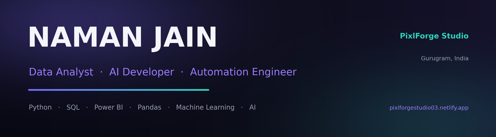

### Founder of **PixlForge Studio** · Gurugram, India 🇮🇳
**I design autonomous AI agents & data products** that turn messy data and manual operations into clean dashboards, automations and decisions.

---

## 👨‍💻 About me

- 🤖 **AI Developer & Data Analyst** — I build **agentic AI products**: document-reading agents, auto-reporting agents, anomaly detection and chat-with-your-data analysts.
- 🏢 Founder of **PixlForge Studio** — AI automation, data dashboards and websites for real businesses.
- 🧠 Stack I build on — **Python · SQL · n8n · Anthropic Claude · Streamlit · Power BI · Google Apps Script**.
- 📊 Data Analyst Intern @ **Nishtya Infotech** — cleaning, EDA and KPI reporting on real business data.
- 🎓 **B.Tech Computer Science — Data Science** @ The NorthCap University, Gurugram (2022–2026).

---

## 🤖 Flagship AI Agents &amp; Products

> Production-grade, **self-hosted** AI agents I design end-to-end — **Claude does the reasoning**, while **n8n / Apps Script / Streamlit** handle the plumbing. These are **real, running systems — not mockups.**

<!-- ───────────────────────── AutoBooks AI ───────────────────────── -->

### 🧾 PixlForge AutoBooks AI
**Autonomous bookkeeping agent for US accounting &amp; CPA firms.** Reads emailed invoices, writes branded weekly client reports, flags fraud &amp; anomalies, onboards new clients and scores tax-readiness — automatically, **24/7**. Ships as **5 importable n8n workflows + a live dashboard**.

&nbsp;[**→ View repo**](https://github.com/Namanjain723/pixlforge-autobooks-ai)

---

<!-- ───────────────────────── Command Center ───────────────────────── -->

### 🏢 PixlForge Command Center
**Real-time operational command center for multi-location retail.** Unifies **8 custom Google Apps Script systems** into one live dashboard — MIS employee scoring, live alteration pipeline, task delegation, broadcast circulars, a voice assistant and dark/light theming. Built **single-handed** for a **73-employee, 7-location** retailer.

&nbsp;[**→ View repo**](https://github.com/Namanjain723/pixlforge-command-center) · [**Live demo**](https://pixlforgestudio03.netlify.app/)

---

<!-- ───────────────────────── Pulse ───────────────────────── -->

### 📣 PixlForge Pulse
**Autonomous AI marketing-reporting agent — white-label ready.** Turns raw marketing data into **branded, client-ready reports** on autopilot, so agencies can scale reporting without scaling headcount. Self-hosted on n8n with Claude-written narratives.

&nbsp;[**→ View repo**](https://github.com/Namanjain723/pixlforge-pulse)

---

<!-- ───────────────────────── IntelliSheets ───────────────────────── -->

### 📊 PixlForge IntelliSheets AI
**Self-hosted agentic data studio.** Drop in a messy spreadsheet → it **auto-cleans the data**, builds dashboards (including interactive **3D**), generates **forecasts &amp; benchmarks**, and answers questions through a **chat-with-your-data AI analyst**.

&nbsp;[**→ View repo**](https://github.com/Namanjain723/pixlforge-intellisheets)

<table>
<tr>
<td width="50%"></td>
<td width="50%"></td>
</tr>
</table>

---

## 📌 More projects — Data, ML &amp; BI

| Project | What it does | Stack |
|---------|--------------|-------|
| ₿ **[Bitcoin Sentiment Trader Analysis](https://github.com/Namanjain723/Bitcoin-Sentiment-Trader-Analysis)** | How market Fear &amp; Greed drives trader profitability &amp; risk, on real trade data | Python · Pandas |
| 📊 **[Sales Performance &amp; Customer Insights](https://github.com/Namanjain723/sales-performance-and-customer-insights-dashboard-)** | Power BI + SQL Server BI dashboards on AdventureWorks | SQL · Power BI · DAX |
| 📈 **[Stock Price Prediction (LSTM)](https://github.com/Namanjain723/Stock-prediction-)** | Deep-learning time-series forecast of Netflix prices | TensorFlow · Keras |
| 🚢 **[Titanic Survival Classification](https://github.com/Namanjain723/Titanic-classification)** | EDA + ML classification of passenger survival | scikit-learn |
| 🧪 **[A/B Testing Analysis](https://github.com/Namanjain723/AB-test-ananlysis-)** | Two-sample t-test to validate an experiment | SciPy · Pandas |

---

## 🧰 Tech stack

**Languages &amp; Querying**

**AI · Agents · Automation**

**Data &amp; ML**

**Visualization &amp; BI**

---

## 💼 Experience

**Data Analyst Intern** — *Nishtya Infotech Pvt. Ltd., Gurugram* · Jun 2025 – Mar 2026
- Cleaned &amp; analysed **10,000+ records** with SQL and Excel, improving data accuracy and consistency.
- Ran **EDA** to surface trends, anomalies and performance gaps.
- Built **KPI reports** and visual summaries that supported data-driven business decisions.

## 📚 Publication

**Business Performance Optimization Through Sales Data Analysis** — preprint on **Zenodo**
🔗 DOI: [10.5281/zenodo.18069636](https://doi.org/10.5281/zenodo.18069636)

## 🎓 Education

**B.Tech in Computer Science — Specialization in Data Science**
🏫 *The NorthCap University, Gurugram* · 📅 *2022 – 2026*

## 📜 Certifications

- **Jobaaj Learning** — Data &amp; Business Analytics Specialisation (Nano Degree)
- **Microsoft &amp; NASBA** — Learning Data Analytics (Part 2)
- **Physics Wallah** — Data Science with Generative AI
- **Microsoft** — Azure Internship &amp; Training

---

### 📫 Let's build something

*Open to AI / Data Analyst / ML roles &amp; freelance — worldwide.* ⚡ **Naman Jain** · PixlForge Studio

